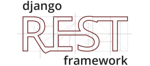

#What is it?
*fluent.id* is a website targeted to help students and learners train their english speaking skill. We facilitate anonymous conversations between users to improve their confidence, vocabulary, and overall fluency in english speech. Fluent aims to disrupt traditional teaching methods which are either basic or expensive.

This was my first-ever large scale project, and my first exposure to web development frameworks- most notably React.js and Django.

Work on Fluent was started on the June of 2019. Due to several reasons, we went on a pause starting from the following September.

##Why make it?
We found that the average Indonesian IELTS speaking  score is 2 points lower than comprehension scores, such as listening and reading. We also found that widely available english courses in Indonesia don’t accommodate for significant improvement in speech. 

By allowing users to simply converse with each other, we want a more natural proficiency to develop - unlike a *“learned”* proficiency that will more easily disappear. In this way, we also remove the need for professional tutors and keep Fluent to be free, open, and accessible for a wide audience range.

##Tools
| | | |
|:---:|:---:|:---:|
|  |  |  |
|  |  |  |
