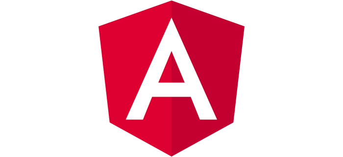

#What is it?
*MediumWell* is a lightweight text editor app, featuring rich text editing and autosync. It integrates *yabwe*'s [MediumEditor](https://github.com/yabwe/medium-editor) with a Firebase backend and an Angular frontend.

I'm considering pushing it a little further and introducing MathJax integration. It would be another learning experience for me.

##Why make it?
It was built as a part of an interview application for my 2B Co-op term. They provided general specifications, plus the additional requirement that it uses Angular and Firebase.

(I never found out if they liked it, because I got matched before they got back to me.)

##Did I learn anything?

This project challenged me to explore other frontend frameworks, outside my core competencies of React and its close friends. It was fascinating to see the concrete decisions that set aside these 2 giants. Angular's data bindings which enforce the MVC pattern were also very pleasant to work with.

Of all of Angular's bits and pieces, I'm most pleased that this project allowed me to learn its templating engine. While I personally still prefer JSX, I'm sure that this comprehension will be useful to me in the future - for example, Vue implements a templating that similarly uses "magic attributes".

The MediumEditor aspect also introduced me to `contentEditable`, a wonderful attribute that is currently in HTML's living specification. (Check it out if you haven't heard of it!)

I also tried my best to design a simplistic but pleasant UI. I sketched out the general design on paper, and prototyped it in Figma. You can see my designs [here](https://www.figma.com/file/TXjSjYRZKY1th2rqbXxXBZ/MediumWell?node-id=0%3A1).
##Tools
| | |
|:---:|:---:|
|  |  |
|  | |
